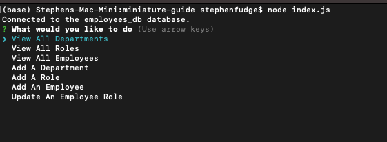

# miniature-guide

## Employee Tracker - Challenge Assignment 12 SQL

- *What was your motivation?*  I wanted to be able to create a way to keep track employees
- *Why did you build this project?*  To be able to track employees and departments and add/update employees and roles
- *What problem does it solve?*  It solves the problem of having to manually adding employees into each table.
- *What did I learn?* I learned how to access MySQL tables using Javascript. I learned how to use the JOIN functions for SQL as well.

## Installation

*What are the steps required to install your project? Provide a step-by-step description of how to get the development environment running.*

Download index.js, the package.json file and all the files in the db folder. Then from your terminal run 'npm i' to install the packages associated with this project. Also you'll want to connect to mysql in terminal then source both the schema.sql and seeds.sql. 

## Usage

*Provide instructions and examples for use. Include screenshots as needed.*

To run the application, after you have downloaded the files and completed the installation steps above. From your terminal you will want to run 'node index.js' and answer the question prompts that appear.

Below is a screenshot of what the terminal should look like after the questions have appeared.  

There is also a [Video Link](https://youtu.be/id7-Bpw2NgM)

## Credits
I used w3schools for help with connecting the SQL queries into Javascript and also for JOIN statements. I used https://www.npmjs.com/ for documentation on the packages so that I knew how to manipulate the data.  
